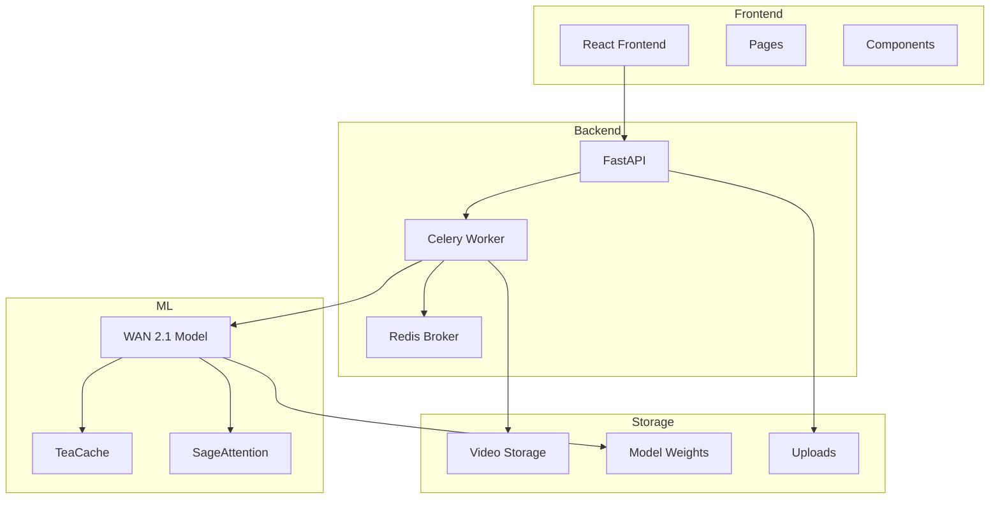

# Структура проекта WAN I2V

```
demo-wan-i2v/
├─ backend/                    # Backend на FastAPI
│  ├─ app/                    # Основной код приложения
│  │  ├─ __init__.py         # Инициализация пакета
│  │  ├─ main.py             # Точка входа FastAPI
│  │  ├─ api/                # API endpoints
│  │  │  ├─ auth.py         # Аутентификация
│  │  │  └─ generate.py     # Генерация видео
│  │  ├─ services/          # Бизнес-логика
│  │  │  ├─ video.py        # Обработка видео
│  │  │  └─ ffmpeg.py       # Работа с FFmpeg
│  │  ├─ worker.py          # Celery worker
│  │  └─ models.py          # ORM модели
│  ├─ requirements.txt       # Зависимости Python
│  └─ Dockerfile            # Сборка backend
│
├─ frontend/                  # Frontend на React
│  ├─ public/               # Статические файлы
│  │  └─ beep.mp3          # Звуки интерфейса
│  ├─ src/                  # Исходный код
│  │  ├─ App.tsx           # Корневой компонент
│  │  ├─ pages/            # Страницы
│  │  │  ├─ Home.tsx       # Главная
│  │  │  └─ Generate.tsx   # Генерация
│  │  └─ components/       # Компоненты
│  │     ├─ Upload.tsx     # Загрузка
│  │     └─ Player.tsx     # Плеер
│  ├─ package.json         # Зависимости Node
│  └─ vite.config.ts       # Конфиг Vite
│
├─ infra/                    # Инфраструктура
│  ├─ docker-compose.yml    # Docker Compose
│  └─ .env                  # Переменные окружения
│
└─ README.md                # Документация
```

# Архитектура проекта WAN I2V

## Общая структура



## Компоненты системы

### 1. Frontend (React + TypeScript)
- **Pages/**
  - Главная страница
  - Страница загрузки
  - Страница результатов
- **Components/**
  - Форма загрузки
  - Плеер видео
  - Индикатор прогресса

### 2. Backend (FastAPI)
- **API Endpoints**
  - `/api/generate` - Запуск генерации
  - `/api/status` - Статус задачи
  - `/api/download` - Скачивание результата
- **Services**
  - Аутентификация
  - Управление задачами
  - Обработка файлов

### 3. Worker (Celery)
- **Tasks**
  - `generate_video_task_async` - Генерация видео
- **Queues**
  - `gpu0` - Очередь для GPU 0
  - `gpu1` - Очередь для GPU 1

### 4. ML Pipeline
- **WAN 2.1**
  - Модель для генерации видео
  - Оптимизации через TeaCache
  - Ускорение через SageAttention
- **Оптимизации**
  - FP16 вычисления
  - Кэширование
  - Квантизация

### 5. Storage
- **Volumes**
  - `/app/videos` - Готовые видео
  - `/app/uploads` - Загруженные изображения
  - `/models` - Веса моделей

## Поток данных

1. **Загрузка изображения**
   ```
   Client -> Frontend -> API -> Storage
   ```

2. **Генерация видео**
   ```
   API -> Redis -> Worker -> WAN Model -> Storage
   ```

3. **Получение результата**
   ```
   Storage -> API -> Frontend -> Client
   ```

## Конфигурация

### Переменные окружения
```env
BROKER_URL=redis://redis:6379/0
WAN_MODEL_PATH=/models/wan14B-720p
JWT_SECRET=change_me_very_secret
INSTALL_COMFY=true
INSTALL_WAN=true
```

### Порты
- `8000` - FastAPI
- `8188` - ComfyUI
- `8888` - JupyterLab

## Масштабирование

- **Горизонтальное**
  - Добавление новых GPU воркеров
  - Балансировка нагрузки через очереди

- **Вертикальное**
  - Оптимизация ML пайплайна
  - Кэширование результатов
  - Асинхронная обработка 